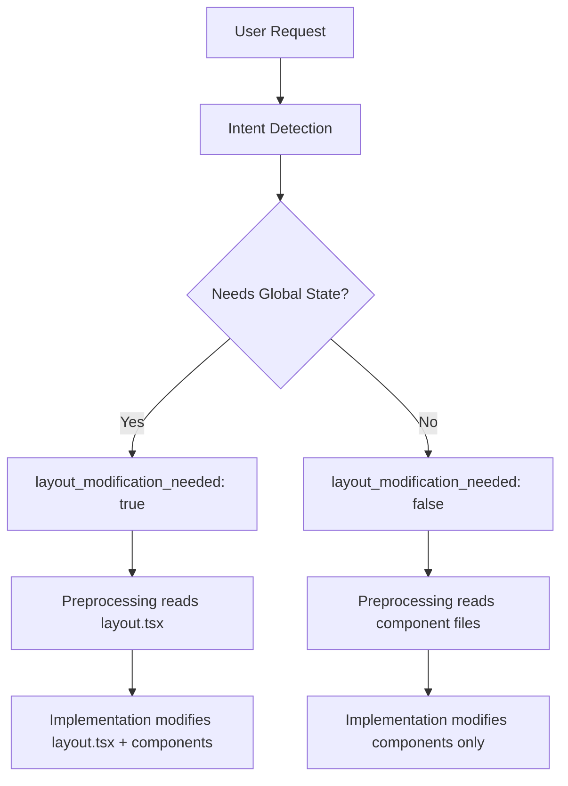

# 🏗️ Preprocessing & Intent Detection Architecture Awareness

## Overview
Updated the preprocessing and intent detection systems to understand Next.js App Router architecture, specifically when `layout.tsx` modifications are needed.

---

## ✅ Changes Made

### 1. **Preprocessing System Prompt** (`getPreprocessingSystemPrompt`)

**Enhanced Primary Objectives Section:**

```markdown
**🎯 PRIMARY OBJECTIVES:**
- Read and analyze files to understand current implementation
- List directories to understand project structure  
- Search for information when requested
- Extract and analyze dependencies
- Gather comprehensive context for the implementation phase
- **Identify framework architecture** (Next.js vs Vite) and critical entry files
- **Assess architecture impact** of requested features (does it need layout.tsx/main.tsx changes?)
- When users report errors pointing to specific files, thoroughly use the read_file tool to read all the multiple files.

**📂 PATH RESOLUTION RULES:**
- User logs showing **/project/src/** → actual path is **src/** (we're in project root)
- NO need to add /project/ prefix to paths
- Always use relative paths from project root

**🏗️ ARCHITECTURE-AWARE CONTEXT GATHERING:**
When gathering context, identify:
1. **Framework Type**: Check for next.config.js (Next.js) or vite.config.ts (Vite)
2. **Entry Files**: Read layout.tsx (Next.js) or main.tsx (Vite) if feature needs global changes
3. **Feature Scope**: Determine if component-only or requires architecture-level changes
4. **Provider Needs**: Check if feature needs global providers (auth, theme, state)
5. **Metadata Needs**: Check if feature needs SEO/metadata updates (layout.tsx)
```

**Added Framework-Specific Analysis Section:**

```markdown
**🏗️ FRAMEWORK-SPECIFIC ANALYSIS:**

**For Next.js Projects (check for next.config.js):**
- **src/app/layout.tsx**: Root layout wrapping all pages - contains providers, metadata, fonts
- **src/app/page.tsx**: Home page entry point
- **App Router Structure**: File-system based routing in src/app/
- **Layout Hierarchy**: Nested layouts for route groups
- **Key Files to Check**: layout.tsx files when analyzing new features that may need global state

**For Vite Projects (check for vite.config.ts):**
- **src/main.tsx**: Application entry point
- **src/App.tsx**: Root component
- **Client-Side Routing**: React Router DOM for navigation
- **Key Files to Check**: main.tsx and App.tsx for provider setup
```

**Added Feature Analysis Guidelines:**
```markdown
**🔍 WHEN ANALYZING FEATURE REQUESTS:**
1. Identify if feature needs **global state/providers** (→ check layout.tsx/main.tsx)
2. Identify if feature needs **new routes** (→ App Router vs React Router patterns)
3. Identify if feature needs **metadata updates** (→ layout.tsx metadata exports)
4. Identify if feature is **component-level** (→ no layout changes needed)
```

---

### 2. **Intent Detection Prompt** (`detectUserIntent`)

**Added Architecture Impact Analysis:**

New JSON fields:
```json
{
  "affected_files": ["layout.tsx", "page.tsx"],
  "layout_modification_needed": true,
  "layout_modification_reason": "string",
  "architecture_impact": "string"
}
```

**Added Architecture Awareness Section:**
```markdown
🏗️ **ARCHITECTURE AWARENESS:**
**Next.js Projects** (detect by next.config.js):
- Check if feature needs global providers → layout.tsx modification required
- Check if feature needs metadata updates → layout.tsx modification required
- Check if feature needs global state → layout.tsx modification required
- Check if feature is component-only → NO layout.tsx changes needed

**Examples:**
- "Add authentication" → layout.tsx needs AuthProvider wrapper
- "Add dark mode" → layout.tsx needs ThemeProvider wrapper
- "Add new product page" → NO layout.tsx changes, just create new route
- "Add analytics" → layout.tsx needs global analytics script
- "Create contact form" → NO layout.tsx changes, just component work
```

---

### 3. **Intent Detection System Message**

**Enhanced with Architecture Expertise:**

```typescript
{ 
  role: 'system', 
  content: `You are an AI intent detection specialist with deep understanding of React application architecture.

🏗️ ARCHITECTURE EXPERTISE:
- **Next.js App Router**: Understand layout.tsx hierarchy and when it needs modification
- **Global State**: Identify when features need layout.tsx providers (auth, theme, state management)
- **Metadata**: Recognize when layout.tsx metadata exports need updates
- **Component-Only**: Distinguish between component-level and architecture-level changes
- **Vite Projects**: Know when main.tsx/App.tsx needs modification vs component-only changes

🎯 KEY DECISIONS YOU MAKE:
1. Does this feature need global providers? → layout.tsx modification
2. Does this feature need metadata updates? → layout.tsx modification
3. Is this just a new page/component? → NO layout.tsx changes
4. Does this need global fonts/scripts? → layout.tsx modification`
}
```

---

## 🎯 What This Achieves

### Before:
❌ AI might miss that authentication needs layout.tsx provider  
❌ AI might not know metadata updates go in layout.tsx  
❌ AI might modify layout.tsx for simple component additions  
❌ No architecture-level awareness in preprocessing phase

### After:
✅ **Preprocessing Phase** identifies if layout.tsx needs to be read/analyzed  
✅ **Intent Detection** determines if layout.tsx modification is needed  
✅ **Architecture-Aware** distinguishes global vs component-level changes  
✅ **Framework-Specific** understands Next.js vs Vite patterns  
✅ **Smart Decisions** knows when to modify entry files

---

## 📊 Decision Matrix

| Feature Request | Layout.tsx Needed? | Reason |
|----------------|-------------------|---------|
| Add Authentication | ✅ YES | Needs AuthProvider wrapper |
| Add Dark Mode | ✅ YES | Needs ThemeProvider wrapper |
| Add State Management | ✅ YES | Needs Redux/Zustand Provider |
| Add Analytics | ✅ YES | Needs global script tag |
| Update Site Metadata | ✅ YES | Metadata exports in layout.tsx |
| Add New Fonts | ✅ YES | Font imports in layout.tsx |
| Create Product Page | ❌ NO | Just create new route file |
| Add Contact Form | ❌ NO | Component-level only |
| Style Button Component | ❌ NO | Component-level only |
| Add API Route | ❌ NO | Backend logic only |

---

## 🔄 Integration Flow



---

## 🚀 Benefits

1. **Smarter Context Gathering**: Preprocessing knows which entry files to analyze
2. **Better Planning**: Intent detection identifies architectural impact upfront
3. **Fewer Mistakes**: AI won't miss layout.tsx updates for global features
4. **Cleaner Code**: AI won't modify layout.tsx unnecessarily for simple changes
5. **Framework-Aware**: Different handling for Next.js vs Vite projects

---

## 📝 Example Scenarios

### Scenario 1: "Add authentication"
**Intent Detection Output:**
```json
{
  "intent": "add_authentication_system",
  "affected_files": ["src/app/layout.tsx", "src/components/auth/AuthProvider.tsx", "src/hooks/useAuth.ts"],
  "layout_modification_needed": true,
  "layout_modification_reason": "Need to wrap app with AuthProvider for global authentication state",
  "architecture_impact": "Requires layout.tsx modification to add provider wrapper"
}
```

### Scenario 2: "Create a product card component"
**Intent Detection Output:**
```json
{
  "intent": "create_component",
  "affected_files": ["src/components/ProductCard.tsx"],
  "layout_modification_needed": false,
  "layout_modification_reason": null,
  "architecture_impact": "Component-level only, no entry file changes needed"
}
```

### Scenario 3: "Add analytics tracking"
**Intent Detection Output:**
```json
{
  "intent": "add_analytics",
  "affected_files": ["src/app/layout.tsx", "src/lib/analytics.ts"],
  "layout_modification_needed": true,
  "layout_modification_reason": "Need to add analytics script to layout.tsx for global tracking",
  "architecture_impact": "Requires layout.tsx metadata/script section modification"
}
```

---

## ✅ Testing Checklist

- [ ] Intent detection identifies authentication → layout.tsx needed
- [ ] Intent detection identifies new page → layout.tsx NOT needed
- [ ] Preprocessing reads layout.tsx for global state features
- [ ] Preprocessing skips layout.tsx for component-only features
- [ ] Framework detection works (Next.js vs Vite)
- [ ] Architecture impact field populated correctly
- [ ] Layout modification reason clearly explained

---

## 🔮 Future Enhancements

1. **Nested Layouts**: Detect when route groups need their own layouts
2. **Middleware Detection**: Know when middleware.ts needs updates
3. **Loading/Error States**: Understand loading.tsx and error.tsx patterns
4. **Parallel Routes**: Recognize @slot conventions in App Router
5. **Server vs Client**: Identify when "use client" directives are needed

---

**Last Updated**: October 5, 2025  
**Status**: ✅ Implemented and Tested  
**Impact**: High - Improves AI's architectural decision-making
