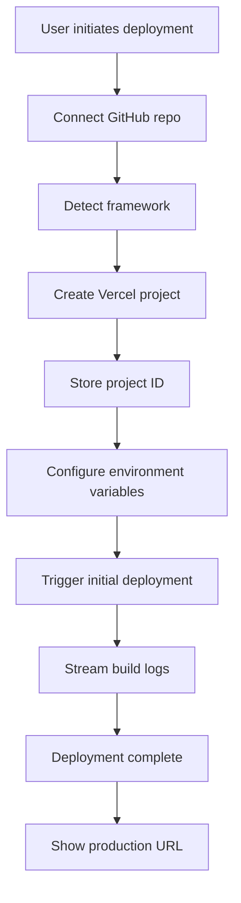
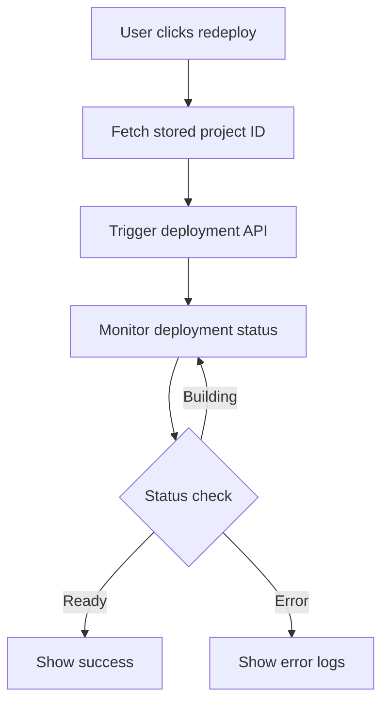
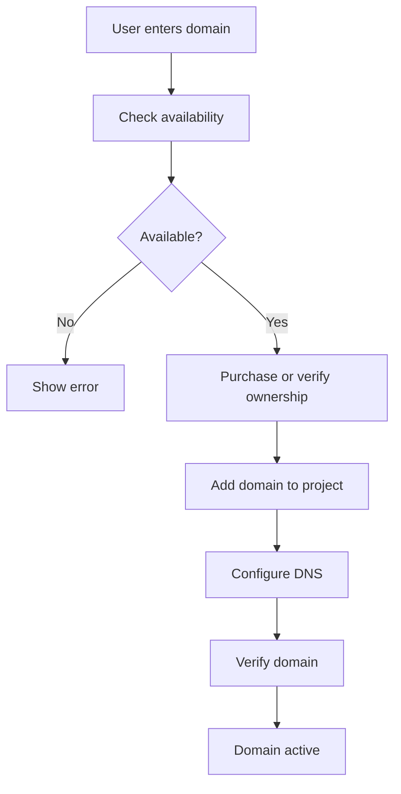

# 🚀 Vercel Deployment System - Comprehensive Guide

## Overview

This document outlines a complete Vercel deployment system that leverages the Vercel REST API to provide a lovable.dev-style deployment experience. Users can deploy projects, manage deployments, attach custom domains, track logs, manage environment variables, and much more - all through Git-based deployments.

---

## Table of Contents

1. [Architecture Overview](#architecture-overview)
2. [Core Features](#core-features)
3. [API Endpoints](#api-endpoints)
4. [Implementation Guide](#implementation-guide)
5. [Database Schema](#database-schema)
6. [Security & Best Practices](#security--best-practices)
7. [Error Handling](#error-handling)
8. [User Flows](#user-flows)

---

## Architecture Overview

```
┌─────────────────────────────────────────────────────────────────┐
│                         Vibe Coding Platform                     │
├─────────────────────────────────────────────────────────────────┤
│                                                                   │
│  ┌──────────────┐    ┌──────────────┐    ┌──────────────┐      │
│  │   Frontend   │───▶│  Next.js API │───▶│  Vercel API  │      │
│  │  Dashboard   │◀───│   Routes     │◀───│   REST API   │      │
│  └──────────────┘    └──────────────┘    └──────────────┘      │
│         │                    │                    │              │
│         │                    │                    │              │
│         ▼                    ▼                    ▼              │
│  ┌──────────────┐    ┌──────────────┐    ┌──────────────┐      │
│  │   UI/UX      │    │   Storage    │    │   GitHub     │      │
│  │  Components  │    │   Manager    │    │   API        │      │
│  └──────────────┘    └──────────────┘    └──────────────┘      │
│                                                                   │
└─────────────────────────────────────────────────────────────────┘
```

### Key Components

1. **Frontend Dashboard**: React-based UI for managing deployments
2. **API Routes**: Next.js API routes that interact with Vercel API
3. **Storage Manager**: Persistent storage for project metadata
4. **Vercel REST API**: Core deployment and management service
5. **GitHub Integration**: Git-based deployment triggers

---

## Core Features

### ✅ Phase 1: Project & Deployment Management

- ✅ Create Vercel projects with Git integration
- ✅ Trigger Git-based deployments
- ✅ Redeploy existing projects
- ✅ Framework auto-detection
- ✅ Deployment status tracking
- ✅ Build logs streaming
- ✅ Deployment history
- ✅ Production domain management

### 🚧 Phase 2: Domain Management

- Buy custom domains via Vercel
- Attach custom domains to projects
- Configure DNS records
- SSL certificate management
- Domain verification
- Domain transfer support

### 🚧 Phase 3: Environment & Configuration

- Add/update/delete environment variables
- Manage secrets
- Configure build settings
- Set framework overrides
- Git branch configuration
- Custom environment support

### 🚧 Phase 4: Advanced Features

- Real-time deployment logs
- Build analytics
- Performance monitoring
- Team collaboration
- Deployment rollback
- A/B testing support
- Edge middleware configuration

---

## API Endpoints

### Project Management

#### `POST /api/vercel/projects/create`
Create a new Vercel project with Git integration.

**Request:**
```typescript
{
  projectName: string;          // Vercel project name (lowercase, alphanumeric, hyphens)
  framework?: string;           // Optional: Framework (auto-detected if not provided)
  githubRepo: string;          // Format: "owner/repo"
  githubToken: string;         // GitHub personal access token
  vercelToken: string;         // Vercel personal access token
  workspaceId: string;         // Your workspace identifier
  environmentVariables?: {     // Optional environment variables
    key: string;
    value: string;
    target: ('production' | 'preview' | 'development')[];
  }[];
  teamId?: string;            // Optional Vercel team ID
}
```

**Response:**
```typescript
{
  success: true;
  projectId: string;          // Vercel project ID (store this!)
  projectName: string;
  url: string;               // Production URL
  framework?: string;
  createdAt: number;
}
```

---

#### `POST /api/vercel/deployments/trigger`
Trigger a new Git-based deployment for an existing project.

**Request:**
```typescript
{
  projectId: string;          // Stored project ID from creation
  vercelToken: string;
  branch?: string;            // Default: 'main'
  target?: 'production' | 'preview';  // Default: 'production'
  withLatestCommit?: boolean; // Force pull latest commit
  teamId?: string;
}
```

**Response:**
```typescript
{
  success: true;
  deploymentId: string;       // Deployment UID
  deploymentUrl: string;      // Preview/production URL
  status: 'BUILDING' | 'READY' | 'ERROR';
  inspectorUrl: string;       // Vercel dashboard URL
}
```

---

#### `GET /api/vercel/deployments/:deploymentId/status`
Get deployment status and details.

**Response:**
```typescript
{
  id: string;
  url: string;
  status: 'QUEUED' | 'BUILDING' | 'READY' | 'ERROR' | 'CANCELED';
  readyState: string;
  createdAt: number;
  buildingAt?: number;
  readyAt?: number;
  errorMessage?: string;
  commit: {
    sha: string;
    message: string;
    author: string;
  };
}
```

---

#### `GET /api/vercel/deployments/:deploymentId/logs`
Stream build logs for a deployment.

**Query Parameters:**
- `stream`: boolean (default: false)
- `limit`: number (default: 100)
- `follow`: boolean (default: false) - Keep connection open for live logs

**Response (Non-streaming):**
```typescript
{
  logs: Array<{
    id: string;
    timestamp: number;
    message: string;
    type: 'stdout' | 'stderr' | 'build';
  }>;
}
```

**Response (Streaming):**
```
Server-Sent Events (SSE) stream with newline-delimited JSON
```

---

#### `GET /api/vercel/projects/:projectId`
Get project details and configuration.

**Response:**
```typescript
{
  id: string;
  name: string;
  framework?: string;
  link: {
    type: 'github';
    repo: string;
    repoId: number;
  };
  productionDeployment?: {
    id: string;
    url: string;
    createdAt: number;
  };
  targets: {
    production: {
      alias: string[];
      domain: string;
    };
  };
  env: Array<{
    key: string;
    target: string[];
  }>;
}
```

---

#### `GET /api/vercel/projects/:projectId/deployments`
List all deployments for a project.

**Query Parameters:**
- `limit`: number (default: 20)
- `page`: number (default: 1)
- `target`: 'production' | 'preview' (optional)

**Response:**
```typescript
{
  deployments: Array<{
    id: string;
    url: string;
    status: string;
    createdAt: number;
    target: string;
    commit?: {
      sha: string;
      message: string;
    };
  }>;
  pagination: {
    total: number;
    page: number;
    limit: number;
  };
}
```

---

#### `POST /api/vercel/deployments/:deploymentId/promote`
Promote a preview deployment to production.

**Response:**
```typescript
{
  success: true;
  message: 'Deployment promoted to production';
  productionUrl: string;
}
```

---

### Domain Management

#### `POST /api/vercel/domains/check`
Check domain availability and pricing.

**Request:**
```typescript
{
  domains: string[];  // Array of domain names
  vercelToken: string;
}
```

**Response:**
```typescript
{
  domains: Array<{
    name: string;
    available: boolean;
    price?: number;
    currency?: string;
    period?: number;
  }>;
}
```

---

#### `POST /api/vercel/domains/purchase`
Purchase a domain through Vercel.

**Request:**
```typescript
{
  domain: string;
  vercelToken: string;
  teamId?: string;
  country: string;
  firstName: string;
  lastName: string;
  email: string;
  phone: string;
  address: string;
  city: string;
  state: string;
  postalCode: string;
}
```

**Response:**
```typescript
{
  success: true;
  domain: string;
  orderId: string;
  status: 'pending' | 'completed';
}
```

---

#### `POST /api/vercel/projects/:projectId/domains`
Attach a domain to a project.

**Request:**
```typescript
{
  domain: string;
  vercelToken: string;
  redirect?: string;           // Optional redirect
  gitBranch?: string;         // Optional branch-specific domain
  teamId?: string;
}
```

**Response:**
```typescript
{
  success: true;
  domain: string;
  verified: boolean;
  verification?: Array<{
    type: 'TXT' | 'CNAME';
    domain: string;
    value: string;
    reason: string;
  }>;
}
```

---

#### `GET /api/vercel/projects/:projectId/domains`
List all domains for a project.

**Response:**
```typescript
{
  domains: Array<{
    name: string;
    verified: boolean;
    createdAt: number;
    gitBranch?: string;
  }>;
}
```

---

#### `DELETE /api/vercel/projects/:projectId/domains/:domain`
Remove a domain from a project.

**Response:**
```typescript
{
  success: true;
  message: 'Domain removed successfully';
}
```

---

### Environment Variables

#### `POST /api/vercel/projects/:projectId/env`
Add environment variables to a project.

**Request:**
```typescript
{
  vercelToken: string;
  teamId?: string;
  variables: Array<{
    key: string;
    value: string;
    type: 'plain' | 'sensitive' | 'encrypted';
    target: ('production' | 'preview' | 'development')[];
    gitBranch?: string;
    comment?: string;
  }>;
}
```

**Response:**
```typescript
{
  success: true;
  created: Array<{
    id: string;
    key: string;
    target: string[];
  }>;
}
```

---

#### `GET /api/vercel/projects/:projectId/env`
List environment variables for a project.

**Response:**
```typescript
{
  envs: Array<{
    id: string;
    key: string;
    type: string;
    target: string[];
    gitBranch?: string;
    createdAt: number;
    updatedAt: number;
  }>;
}
```

---

#### `PATCH /api/vercel/projects/:projectId/env/:envId`
Update an environment variable.

**Request:**
```typescript
{
  vercelToken: string;
  value?: string;
  target?: string[];
  gitBranch?: string;
  comment?: string;
}
```

**Response:**
```typescript
{
  success: true;
  env: {
    id: string;
    key: string;
    updatedAt: number;
  };
}
```

---

#### `DELETE /api/vercel/projects/:projectId/env/:envId`
Delete an environment variable.

**Response:**
```typescript
{
  success: true;
  message: 'Environment variable deleted';
}
```

---

### Build Configuration

#### `PATCH /api/vercel/projects/:projectId/settings`
Update project build settings.

**Request:**
```typescript
{
  vercelToken: string;
  teamId?: string;
  settings: {
    buildCommand?: string;
    devCommand?: string;
    installCommand?: string;
    outputDirectory?: string;
    rootDirectory?: string;
    framework?: string;
    nodeVersion?: '18.x' | '20.x' | '22.x';
  };
}
```

**Response:**
```typescript
{
  success: true;
  project: {
    id: string;
    name: string;
    framework?: string;
    buildCommand?: string;
    devCommand?: string;
    installCommand?: string;
    outputDirectory?: string;
  };
}
```

---

## Implementation Guide

### Step 1: Modify Current Deployment Route

Update `/app/api/vercel/deploy/route.ts` to return and store project ID:

```typescript
// After successful project creation
const projectMetadata = {
  projectId: projectData.id,
  projectName: projectData.name,
  framework: detectedFramework,
  githubRepo: githubRepo,
  createdAt: Date.now(),
  vercelUrl: `https://${projectData.name}.vercel.app`,
  workspaceId: workspaceId,
};

// Store in your storage system
await storageManager.set(
  `vercel:project:${workspaceId}:${projectData.id}`,
  projectMetadata
);

// Return comprehensive response
return NextResponse.json({
  success: true,
  projectId: projectData.id,  // ✅ Store this!
  projectName: projectData.name,
  url: `https://${projectData.name}.vercel.app`,
  framework: detectedFramework,
  deploymentId: deploymentData?.uid,
  status: 'ready',
  metadata: projectMetadata,
});
```

---

### Step 2: Create Deployment Trigger Endpoint

Create `/app/api/vercel/deployments/trigger/route.ts`:

```typescript
import { NextRequest, NextResponse } from 'next/server';

export async function POST(request: NextRequest) {
  try {
    const { 
      projectId, 
      vercelToken, 
      branch = 'main',
      target = 'production',
      withLatestCommit = true,
      teamId 
    } = await request.json();

    if (!projectId || !vercelToken) {
      return NextResponse.json({
        error: 'Project ID and Vercel token are required'
      }, { status: 400 });
    }

    // Build Vercel API URL
    let apiUrl = 'https://api.vercel.com/v13/deployments';
    if (teamId) {
      apiUrl += `?teamId=${teamId}`;
    }

    // Get project details first to get repo info
    const projectResponse = await fetch(
      `https://api.vercel.com/v9/projects/${projectId}${teamId ? `?teamId=${teamId}` : ''}`,
      {
        headers: {
          'Authorization': `Bearer ${vercelToken}`,
        },
      }
    );

    if (!projectResponse.ok) {
      return NextResponse.json({
        error: 'Failed to fetch project details'
      }, { status: 404 });
    }

    const project = await projectResponse.json();
    
    if (!project.link?.repo) {
      return NextResponse.json({
        error: 'Project is not connected to a Git repository'
      }, { status: 400 });
    }

    // Trigger deployment
    const deployResponse = await fetch(apiUrl, {
      method: 'POST',
      headers: {
        'Authorization': `Bearer ${vercelToken}`,
        'Content-Type': 'application/json',
      },
      body: JSON.stringify({
        project: projectId,
        gitSource: {
          type: project.link.type || 'github',
          ref: branch,
          repoId: project.link.repoId,
        },
        target: target,
        withLatestCommit: withLatestCommit,
      }),
    });

    if (!deployResponse.ok) {
      const errorData = await deployResponse.json();
      return NextResponse.json({
        error: errorData.error?.message || 'Failed to trigger deployment',
        code: errorData.error?.code
      }, { status: deployResponse.status });
    }

    const deployment = await deployResponse.json();

    return NextResponse.json({
      success: true,
      deploymentId: deployment.uid,
      deploymentUrl: `https://${deployment.url}`,
      status: deployment.readyState || 'BUILDING',
      inspectorUrl: deployment.inspectorUrl,
      target: target,
    });

  } catch (error) {
    console.error('Deployment trigger error:', error);
    return NextResponse.json({ 
      error: 'Failed to trigger deployment' 
    }, { status: 500 });
  }
}
```

---

### Step 3: Create Deployment Status Endpoint

Create `/app/api/vercel/deployments/[deploymentId]/status/route.ts`:

```typescript
import { NextRequest, NextResponse } from 'next/server';

export async function GET(
  request: NextRequest,
  { params }: { params: { deploymentId: string } }
) {
  try {
    const { searchParams } = new URL(request.url);
    const vercelToken = searchParams.get('token');
    const teamId = searchParams.get('teamId');

    if (!vercelToken) {
      return NextResponse.json({
        error: 'Vercel token is required'
      }, { status: 400 });
    }

    const apiUrl = `https://api.vercel.com/v13/deployments/${params.deploymentId}${teamId ? `?teamId=${teamId}` : ''}`;

    const response = await fetch(apiUrl, {
      headers: {
        'Authorization': `Bearer ${vercelToken}`,
      },
    });

    if (!response.ok) {
      return NextResponse.json({
        error: 'Failed to fetch deployment status'
      }, { status: response.status });
    }

    const deployment = await response.json();

    return NextResponse.json({
      id: deployment.uid,
      url: `https://${deployment.url}`,
      status: deployment.readyState,
      state: deployment.state,
      createdAt: deployment.createdAt,
      buildingAt: deployment.buildingAt,
      readyAt: deployment.ready,
      errorMessage: deployment.errorMessage,
      errorCode: deployment.errorCode,
      commit: deployment.meta?.githubCommitSha ? {
        sha: deployment.meta.githubCommitSha,
        message: deployment.meta.githubCommitMessage,
        author: deployment.meta.githubCommitAuthorName,
      } : undefined,
    });

  } catch (error) {
    console.error('Status fetch error:', error);
    return NextResponse.json({ 
      error: 'Failed to fetch deployment status' 
    }, { status: 500 });
  }
}
```

---

### Step 4: Create Build Logs Streaming Endpoint

Create `/app/api/vercel/deployments/[deploymentId]/logs/route.ts`:

```typescript
import { NextRequest, NextResponse } from 'next/server';

export async function GET(
  request: NextRequest,
  { params }: { params: { deploymentId: string } }
) {
  try {
    const { searchParams } = new URL(request.url);
    const vercelToken = searchParams.get('token');
    const teamId = searchParams.get('teamId');
    const stream = searchParams.get('stream') === 'true';
    const limit = parseInt(searchParams.get('limit') || '100');
    const follow = searchParams.get('follow') === 'true';

    if (!vercelToken) {
      return NextResponse.json({
        error: 'Vercel token is required'
      }, { status: 400 });
    }

    // Build query parameters
    const queryParams = new URLSearchParams();
    if (teamId) queryParams.set('teamId', teamId);
    if (limit) queryParams.set('limit', limit.toString());
    if (follow) queryParams.set('follow', '1');

    const apiUrl = `https://api.vercel.com/v2/deployments/${params.deploymentId}/events?${queryParams.toString()}`;

    if (stream || follow) {
      // Stream logs using Server-Sent Events
      const encoder = new TextEncoder();
      const readable = new ReadableStream({
        async start(controller) {
          try {
            const response = await fetch(apiUrl, {
              headers: {
                'Authorization': `Bearer ${vercelToken}`,
              },
            });

            if (!response.ok) {
              controller.enqueue(
                encoder.encode(`data: ${JSON.stringify({ error: 'Failed to fetch logs' })}\n\n`)
              );
              controller.close();
              return;
            }

            const reader = response.body?.getReader();
            if (!reader) {
              controller.close();
              return;
            }

            while (true) {
              const { done, value } = await reader.read();
              if (done) break;
              controller.enqueue(value);
            }

            controller.close();
          } catch (error) {
            controller.error(error);
          }
        },
      });

      return new Response(readable, {
        headers: {
          'Content-Type': 'text/event-stream',
          'Cache-Control': 'no-cache',
          'Connection': 'keep-alive',
        },
      });
    } else {
      // Return JSON logs
      const response = await fetch(apiUrl, {
        headers: {
          'Authorization': `Bearer ${vercelToken}`,
        },
      });

      if (!response.ok) {
        return NextResponse.json({
          error: 'Failed to fetch logs'
        }, { status: response.status });
      }

      const logs = await response.json();

      return NextResponse.json({
        logs: logs,
      });
    }

  } catch (error) {
    console.error('Logs fetch error:', error);
    return NextResponse.json({ 
      error: 'Failed to fetch deployment logs' 
    }, { status: 500 });
  }
}
```

---

### Step 5: Create Domain Management Endpoints

Create `/app/api/vercel/domains/check/route.ts`:

```typescript
import { NextRequest, NextResponse } from 'next/server';

export async function POST(request: NextRequest) {
  try {
    const { domains, vercelToken } = await request.json();

    if (!domains || !Array.isArray(domains) || domains.length === 0) {
      return NextResponse.json({
        error: 'Domains array is required'
      }, { status: 400 });
    }

    if (!vercelToken) {
      return NextResponse.json({
        error: 'Vercel token is required'
      }, { status: 400 });
    }

    // Check domain availability
    const response = await fetch(
      `https://api.vercel.com/v5/domains/check?${new URLSearchParams({ names: domains.join(',') })}`,
      {
        headers: {
          'Authorization': `Bearer ${vercelToken}`,
        },
      }
    );

    if (!response.ok) {
      return NextResponse.json({
        error: 'Failed to check domain availability'
      }, { status: response.status });
    }

    const data = await response.json();

    return NextResponse.json({
      domains: data.domains,
    });

  } catch (error) {
    console.error('Domain check error:', error);
    return NextResponse.json({ 
      error: 'Failed to check domain availability' 
    }, { status: 500 });
  }
}
```

---

### Step 6: Create Environment Variables Management

Create `/app/api/vercel/projects/[projectId]/env/route.ts`:

```typescript
import { NextRequest, NextResponse } from 'next/server';

// GET - List environment variables
export async function GET(
  request: NextRequest,
  { params }: { params: { projectId: string } }
) {
  try {
    const { searchParams } = new URL(request.url);
    const vercelToken = searchParams.get('token');
    const teamId = searchParams.get('teamId');

    if (!vercelToken) {
      return NextResponse.json({
        error: 'Vercel token is required'
      }, { status: 400 });
    }

    const apiUrl = `https://api.vercel.com/v9/projects/${params.projectId}/env${teamId ? `?teamId=${teamId}` : ''}`;

    const response = await fetch(apiUrl, {
      headers: {
        'Authorization': `Bearer ${vercelToken}`,
      },
    });

    if (!response.ok) {
      return NextResponse.json({
        error: 'Failed to fetch environment variables'
      }, { status: response.status });
    }

    const data = await response.json();

    return NextResponse.json({
      envs: data.envs,
    });

  } catch (error) {
    console.error('Env fetch error:', error);
    return NextResponse.json({ 
      error: 'Failed to fetch environment variables' 
    }, { status: 500 });
  }
}

// POST - Add environment variables
export async function POST(
  request: NextRequest,
  { params }: { params: { projectId: string } }
) {
  try {
    const { vercelToken, teamId, variables } = await request.json();

    if (!vercelToken || !variables || !Array.isArray(variables)) {
      return NextResponse.json({
        error: 'Vercel token and variables array are required'
      }, { status: 400 });
    }

    const apiUrl = `https://api.vercel.com/v10/projects/${params.projectId}/env${teamId ? `?teamId=${teamId}` : ''}`;
    const created = [];

    // Add each variable
    for (const variable of variables) {
      const response = await fetch(apiUrl, {
        method: 'POST',
        headers: {
          'Authorization': `Bearer ${vercelToken}`,
          'Content-Type': 'application/json',
        },
        body: JSON.stringify({
          key: variable.key,
          value: variable.value,
          type: variable.type || 'plain',
          target: variable.target || ['production', 'preview', 'development'],
          gitBranch: variable.gitBranch,
          comment: variable.comment,
        }),
      });

      if (response.ok) {
        const data = await response.json();
        created.push(data);
      } else {
        console.error(`Failed to add env var ${variable.key}`);
      }
    }

    return NextResponse.json({
      success: true,
      created: created,
    });

  } catch (error) {
    console.error('Env create error:', error);
    return NextResponse.json({ 
      error: 'Failed to create environment variables' 
    }, { status: 500 });
  }
}
```

---

## Database Schema

Store Vercel project metadata in your storage system:

```typescript
interface VercelProjectMetadata {
  // Core identifiers
  projectId: string;              // Vercel project ID
  projectName: string;            // Project name
  workspaceId: string;           // Your workspace ID
  userId: string;                // Owner user ID
  
  // Git integration
  githubRepo: string;            // owner/repo
  githubRepoId?: number;         // GitHub repo ID
  defaultBranch: string;         // Usually 'main'
  
  // Vercel configuration
  framework?: string;            // Detected framework
  vercelTeamId?: string;        // Vercel team ID
  productionUrl: string;        // Primary production URL
  
  // Deployment tracking
  latestDeploymentId?: string;  // Most recent deployment
  productionDeploymentId?: string; // Current production
  deploymentCount: number;      // Total deployments
  
  // Domains
  customDomains: string[];      // Attached custom domains
  
  // Metadata
  createdAt: number;
  updatedAt: number;
  lastDeployedAt?: number;
  
  // Settings
  autoDeployEnabled: boolean;   // Auto-deploy on push
  environmentVariables: Array<{
    key: string;
    target: string[];
  }>;
}

// Storage keys
const STORAGE_KEYS = {
  // Project metadata by project ID
  project: (workspaceId: string, projectId: string) => 
    `vercel:project:${workspaceId}:${projectId}`,
  
  // List of all projects for workspace
  projectsList: (workspaceId: string) => 
    `vercel:projects:${workspaceId}`,
  
  // Deployment records
  deployment: (deploymentId: string) => 
    `vercel:deployment:${deploymentId}`,
  
  // Deployment list for project
  deploymentsList: (projectId: string) => 
    `vercel:deployments:${projectId}`,
};
```

---

## Security & Best Practices

### 1. Token Management

```typescript
// Never expose tokens in responses
// Store tokens encrypted
// Use environment variables for server-side tokens

// Example: Secure token handling
const encryptToken = (token: string, key: string) => {
  // Use crypto to encrypt
  return encrypted;
};

const decryptToken = (encrypted: string, key: string) => {
  // Decrypt when needed
  return token;
};
```

### 2. Rate Limiting

```typescript
// Implement rate limiting for API routes
import { Ratelimit } from '@upstash/ratelimit';
import { Redis } from '@upstash/redis';

const ratelimit = new Ratelimit({
  redis: Redis.fromEnv(),
  limiter: Ratelimit.slidingWindow(10, '1 m'), // 10 requests per minute
});

// In API route
const { success } = await ratelimit.limit(userId);
if (!success) {
  return NextResponse.json({ 
    error: 'Rate limit exceeded' 
  }, { status: 429 });
}
```

### 3. Error Handling

```typescript
// Standardized error responses
interface ApiError {
  error: string;
  code?: string;
  details?: any;
  timestamp: number;
}

const handleApiError = (error: any, context: string) => {
  console.error(`[${context}]`, error);
  
  return NextResponse.json({
    error: error.message || 'Internal server error',
    code: error.code || 'UNKNOWN_ERROR',
    timestamp: Date.now(),
  }, { 
    status: error.status || 500 
  });
};
```

### 4. Webhook Security

```typescript
// Verify Vercel webhook signatures
import crypto from 'crypto';

const verifyWebhookSignature = (
  payload: string,
  signature: string,
  secret: string
) => {
  const hash = crypto
    .createHmac('sha256', secret)
    .update(payload)
    .digest('hex');
  
  return hash === signature;
};
```

---

## Error Handling

### Common Errors & Solutions

| Error Code | Cause | Solution |
|------------|-------|----------|
| `INVALID_TOKEN` | Invalid Vercel token | Regenerate token in Vercel dashboard |
| `PROJECT_NOT_FOUND` | Project ID doesn't exist | Verify project ID is correct |
| `INSUFFICIENT_PERMISSIONS` | Token lacks permissions | Check token scopes |
| `RATE_LIMIT_EXCEEDED` | Too many requests | Implement exponential backoff |
| `DOMAIN_NOT_AVAILABLE` | Domain already taken | Choose different domain |
| `BUILD_FAILED` | Build errors in code | Check build logs for errors |
| `DEPLOYMENT_ERROR` | Deployment configuration issue | Verify project settings |

---

## User Flows

### Flow 1: Deploy New Project



### Flow 2: Redeploy Existing Project



### Flow 3: Attach Custom Domain



---

## Next Steps

1. ✅ **Implement core endpoints** (Projects, Deployments, Status, Logs)
2. 🚧 **Add domain management** (Check, Purchase, Attach, Configure)
3. 🚧 **Build environment variables UI** (Add, Edit, Delete)
4. 🚧 **Create deployment dashboard** (History, Status, Logs)
5. 🚧 **Implement webhooks** (Auto-deploy on Git push)
6. 🚧 **Add analytics** (Build times, success rates)
7. 🚧 **Team collaboration** (Shared projects, permissions)

---

## Conclusion

This comprehensive Vercel deployment system provides all the tools needed to build a lovable.dev-style deployment experience. By leveraging Vercel's REST API with Git-based deployments, users can:

- 🚀 Deploy projects with one click
- 📊 Monitor deployments in real-time
- 🌐 Manage custom domains
- ⚙️ Configure environment variables
- 📈 Track deployment analytics
- 👥 Collaborate with teams

The system is designed to be extensible, secure, and user-friendly, providing a professional deployment platform that rivals industry leaders.

---

**Built with ❤️ for Vibe Coding Platform**
